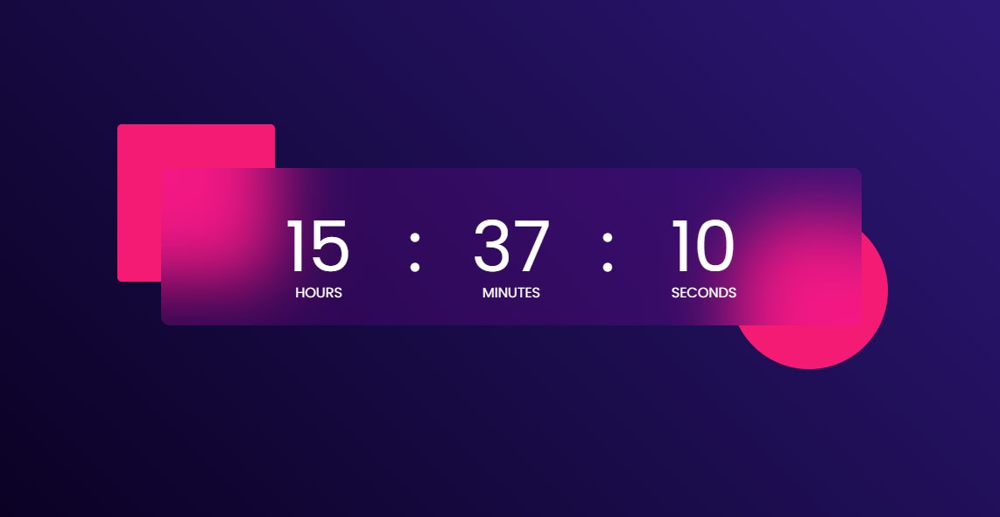

# Appley

[Appley](https://appley.vercel.app) is a basic utility app that houses other small utility apps that can make your life a whole lot easier. Some of the apps included are digital clock, countdown timer, text analyzer, and many more to come.

## Table of contents

- [Overview](#overview)
  - [Screenshot](#screenshot)
  - [Links](#links)
- [My process](#my-process)
  - [Built with](#built-with)
  - [Continued development](#continued-development)
- [Author](#author)
- [Acknowledgments](#acknowledgments)

## Overview

### Screenshot

### Links

- Solution URL: [here](https://github.com/itksweb/appley)
- Live Site URL: [here](https://appley.vercel.app)

## My process

### Built with

- [React](https://reactjs.org/) - JS library

### Continued development

Hope to apply and improve on these principles in more advanced projects. Also will be adding other utilty apps to the project.

## Author

- WhatsApp - [here](https://wa.me/2348060719978)
- LinkedIn - [here](https://www.linkedin.com/in/kingsleyikpefan)
